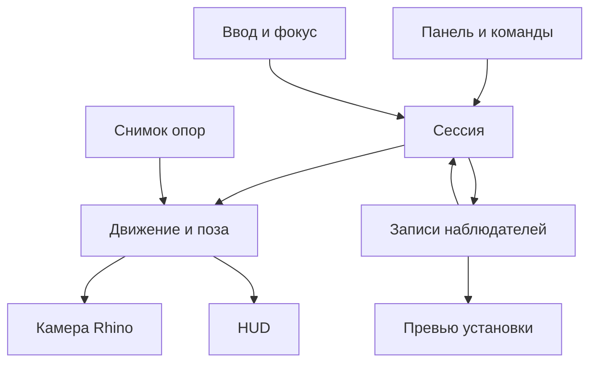

# Техническая архитектура ARCHWALK

Цель архитектуры — управлять родной камерой Rhino и сохранить надёжность рабочего CAD-приложения. Математика движения не зависит от Rhino; взаимодействие с документом, окнами, вводом и отрисовкой вынесено в адаптеры. Здесь описаны обязанности и контракты, без исходного кода и без утверждения, что перечисленные проектные компоненты уже существуют в Rhino SDK.

## 1 Целевая среда

Первая реализация — C# plug-in для RhinoCommon, настольный Rhino 8.25 Windows x64, .NET 8, интерфейс Eto.Forms. Core можно держать независимым от Windows; сборка ввода имеет явную платформенную зависимость. RhinoCommon и Eto берутся из совместимых с установленным Rhino сборок, не поставляются произвольными более новыми копиями в пакете.

В официальном руководстве McNeel указано, что Rhino 8.20 и новее по умолчанию используют .NET 8. Поэтому для 8.25 выбран .NET 8, а не исходный для ранних Rhino 8 .NET 7. Если пользователь переключил Rhino на .NET Framework, это отдельная конфигурация; плагин не переключает runtime самостоятельно. [McNeel о runtime](https://developer.rhino3d.com/guides/rhinocommon/moving-to-dotnet-core/).

В первом техническом этапе фиксируются полный номер установленной сборки Rhino 8.25, RhinoCommon, runtime и Windows. Сборка против «последнего RhinoCommon» без ограничения версии недопустима. Страницы актуального API могут описывать Rhino 9; доступность каждого используемого члена проверяется компиляцией против целевого SDK и запуском в целевом Rhino.

## 2 Компоненты и ответственность

| Проектный компонент | Ответственность | Чего он не делает |
| --- | --- | --- |
| PlugInLifetime | Подписки приложения, регистрация панели и команд, освобождение ресурсов | Не хранит глобальный ActiveDoc как источник каждой операции |
| DocumentContext | Наблюдатели, настройки опоры, единицы и кэш одного документа | Не делит данные с другим документом |
| ObserverRepository | Добавление, правка, удаление, сериализация и Undo/Redo записей | Не обновляет viewport каждый кадр |
| PlacementController | Черновик установки и его подтверждение | Не перехватывает WASD обычного Rhino |
| SessionController | Вход, пауза, выход, владелец камеры и снимка восстановления | Не занимается пересечениями NURBS |
| InputBridge | Клавиши, относительные дельты, фокус, захват и очистка | Не вычисляет физическую траекторию |
| MotionCore | Поза, время, скорость, режимы, ограничения | Не знает HWND, RhinoDoc или Eto |
| GroundService | Поиск опоры и проверка шага по снимку геометрии | Не меняет геометрию модели |
| CameraAdapter | Применение позы, проекция, restore и выходной target | Не читает клавиатуру |
| PreviewRenderer | Последний независимый кадр выбранного наблюдателя | Не использует рабочую камеру как временную мишень |
| ObserverConduit | Маркеры и HUD нужного документа и вида | Не меняет документ из draw callback |
| PanelPresenter | Состояние панели и действия пользователя | Не содержит собственную вторую копию логики камеры |
| Diagnostics | Причины паузы, замеры и локальный технический отчёт | Не отправляет модель или телеметрию в сеть |

Это логические границы. Не нужно создавать отдельный процесс, микросервис или отдельную сборку для каждой строки. Достаточно Core, RhinoIntegration, WindowsInput и тестового проекта с разумным разделением файлов.

## 3 Поток данных

Запись в Repository происходит только по явному действию пользователя. Поза каждого кадра остаётся временной. PreviewRenderer и CameraAdapter используют один преобразователь позы в camera frame/frustum; отдельные несовпадающие формулы запрещены.

## 4 Состояния сессии

| Состояние | Владелец ввода | Основные переходы |
| --- | --- | --- |
| Idle | Rhino | Поставить → PlacingFoot; войти в запись → EnterPending |
| PlacingFoot | Короткая команда выбора точки Rhino | Клик → Aiming; Esc → Idle |
| Aiming | Та же команда, динамическая графика | Клик → PlacementReady; Esc → Idle |
| PlacementReady | Панель и ограниченный обработчик подтверждения | Enter → сохранить и EnterPending; Готово → сохранить и Idle; Esc → Idle |
| EnterPending | Rhino до завершения текущей команды | Успешные проверки → Captured; ошибка → Idle |
| Captured | Только адаптер активного вида | Tab/потеря фокуса → Paused; Esc/Backspace/чужая команда → Ending |
| Paused | Rhino и обычные UI-контролы | Явное продолжение → Captured; выход/команда → Ending |
| Ending | Захват уже освобождён | Однократная очистка и необходимое восстановление → Idle |

PlacementReady остаётся частью короткой операции установки, а не фоновым глобальным ловцом Enter. Все варианты подтверждения создают одну запись наблюдателя. Если запуск прогулки затем не удался, созданная запись остаётся, а камера восстанавливается. Это объясняется коротким сообщением; повторное нажатие Enter не создаёт дубликат.

Инварианты:

- Во всём процессе Rhino одновременно не более одного владельца FPS-ввода.
- Ключ сессии включает runtime serial документа, идентификатор вида и viewport ID.
- В Captured нет текстового поля или стороннего окна с фокусом.
- В Paused/Idle нет скрытого курсора, ограничения курсора и накопленной скорости.
- При Ending повторные вызовы очистки безопасны и не восстанавливают чужое состояние второй раз.
- Зафиксированная поза и snapshot геометрии относятся к одной версии документа.

Повторный запуск AWEnter при Captured не создаёт второй таймер или hook. Он считается запросом переключения: текущая сессия сначала штатно заканчивается, затем начинается новая с новым снимком исходного вида.

## 5 Команды и совместимость с командной системой

Все имена ниже — **новые команды проектируемого плагина**, не встроенные команды Rhino.

| Команда | Действие |
| --- | --- |
| AWPanel | Открыть панель |
| AWPlace | Начать установку |
| AWEnter | Войти в выбранную запись; при отсутствии записи открыть установку |
| AWExit | Выйти с текущим ракурсом |
| AWReturn | Выйти и восстановить исходный вид |
| AWSettings | Открыть настройки |
| AWSaveView | Сохранить текущий кадр в Named Views через интерфейс выбора имени |
| AWResetInput | Безусловно освободить принадлежащий плагину ввод и закончить сессию |

Имена команд английские и стабильные, пользовательские подписи локализованы. Стандартный вызов с префиксом `_` проверяется на русской версии Rhino. Короткие алиасы не устанавливаются глобально без действия пользователя.

GetPoint используется для коротких этапов установки, с DynamicDraw для лёгкого маркера. Нельзя держать бесконечный GetPoint или busy loop на протяжении всей прогулки. После AWEnter RunCommand завершается; сессия живёт модельно независимо и получает UI ticks.

При начале сторонней команды обработчик сначала освобождает ввод и завершает сессию с текущим кадром. Команда не отменяется и не получает нажатия WASD, оставшиеся в очереди. Для запускающих команд плагина используется ограниченный токен перехода, а не общее игнорирование BeginCommand.

## 6 Захват клавиатуры и мыши Windows

### Что даёт RhinoCommon

MouseCallback предназначен для мыши в видах, а его события в начале обработки допускают Cancel. Это полезно для подавления обычного клика/drag в целевом виде. Сам по себе он не решает полный относительный ввод мыши и блокировку клавиатуры. [MouseCallback](https://mcneel.github.io/rhinocommon-api-docs/api/RhinoCommon/html/T_Rhino_UI_MouseCallback.htm).

RhinoApp.KeyboardEvent существует, но документированный делегат принимает только int key и возвращает void. Нельзя приписывать ему отсутствующие Handled/Cancel или считать гарантированным источником всех key-up. Для полноценного FPS требуется проверенный WindowsInputBridge. [Делегат KeyboardHookEvent](https://mcneel.github.io/rhinocommon-api-docs/api/RhinoCommon/html/T_Rhino_RhinoApp_KeyboardHookEvent.htm).

### Базовая стратегия v1

Адаптер Windows ограничен UI-потоком и окнами текущего Rhino. Технический прототип должен выбрать корректную точку обработки native keyboard messages до того, как они станут текстом командной строки или accelerator-командой. Основной кандидат — фильтрация сообщений UI-потока с проверкой целевого HWND, совместно с обработкой окна viewport. Один лишь WinForms IMessageFilter без проверки нельзя объявлять достаточным: Rhino не обязан направлять весь native ввод через него.

Перехватываются key-down и key-up, связанные символьные сообщения и колесо. Состояние физической клавиши отделено от символа. Автоповтор не создаёт лишних действий. `GetAsyncKeyState` допустим как проверка зависшей клавиши только при фокусе Rhino; он не заменяет подавление командной строки и не используется как глобальный монитор клавиатуры.

Системный глобальный low-level hook, переопределение пользовательских алиасов и изменение настроек мыши Windows не являются базовым решением. При невозможности чистой C#-интеграции допустим маленький изолированный native-адаптер на документированных механизмах, после фиксации причины в техническом отчёте. Основной продукт не должен зависеть от недокументированных адресов или reflection во внутренние обработчики Rhino.

### Относительная мышь

Базовый совместимый путь — при захвате скрыть курсор, ограничить его клиентской областью и периодически возвращать к внутренней опорной позиции окна. Физические координаты переводятся в логические по DPI соответствующего монитора. Искусственные события перемещения от recenter отбрасываются по ожидаемой позиции и поколению захвата; реальный следующий input не теряется.

Край монитора, отрицательные координаты второго монитора, масштабирование 100–200%, изменение размеров и перенос окна не должны ограничивать число оборотов. Не менять process-wide DPI awareness уже работающего Rhino. Чувствительность базового адаптера включает поведение драйвера и системную обработку указателя; независимость от аппаратного DPI не обещается.

Самостоятельная регистрация Raw Input **не является выбранным default**. Microsoft предупреждает, что на один класс устройств внутри процесса регистрируется только одно окно и библиотека может нарушить ввод хозяина. Если в будущем используется Raw Input, нужен доказанный способ сосуществования с Rhino и другими плагинами, а не просто вызов RegisterRawInputDevices. [Ограничение Microsoft](https://learn.microsoft.com/en-us/windows/win32/api/winuser/nf-winuser-registerrawinputdevices).

### Жизненный цикл захвата

CaptureLease запоминает ресурсы, изменённые именно этой сессией: состояние захвата, курсора, границы ограничения, подписки и идентификатор окна. Освобождение выполняется при штатном выходе, исключении, деактивации, разрушении HWND, закрытии документа и завершении Rhino. Нельзя вслепую многократно вызывать ShowCursor до некоторого счётчика или отменять чужой новый захват.

Если Rhino ещё на переднем плане, курсор возвращается в сохранённую безопасную позицию. Если фокус уже ушёл в другое приложение, освобождение не перемещает указатель поверх другого приложения. Размеры ограничивающего прямоугольника пересчитываются по клиентской области, без title bar и панели.

При возобновлении все накопленные дельты обнуляются. Клавиши, удерживаемые во время потери фокуса, требуют нового отпускания/нажатия. В режиме паузы не остаётся даже невидимого блокирования скролла.

## 7 Камера и снимок исходного вида

Snapshot создаётся до первой модификации целевого окна и принадлежит одной сессии. Он включает:

- Document/view/viewport identity и признак созданного плагином окна.
- Полную проекцию и camera frame, frustum и target.
- Исходный display mode, если он будет временно изменён.
- Изменяемые плагином локальные grid/axes/overlay-флаги, если такие появятся.
- Исходный активный вид для случая закрытия созданного окна.

CPlane, раскладка окон, имена пользовательских видов и выделение по умолчанию не меняются, поэтому их нельзя бездумно переписывать из старого snapshot при выходе. Глобальные свойства документа вообще не принадлежат этому снимку.

ViewportInfo подходит как основа копии проекции, SetViewProjection — как документированная операция её установки; точная комбинация и target проверяются в 8.25. [ViewportInfo](https://mcneel.github.io/rhinocommon-api-docs/api/RhinoCommon/html/T_Rhino_DocObjects_ViewportInfo.htm), [SetViewProjection](https://mcneel.github.io/rhinocommon-api-docs/api/RhinoCommon/html/M_Rhino_Display_RhinoViewport_SetViewProjection.htm).

Один UI tick применяет согласованное состояние камеры и запрашивает один redraw целевого вида. Нельзя на каждом кадре вызывать команды Rhino, Zoom, WalkAbout или менять названия видов через макросы. Нет обращений к viewport из фонового потока.

Изменение вида самим CameraAdapter помечается внутренним поколением применения. Обратные события view-modified не должны запускать рекурсивное применение. Внешнее изменение камеры во время сессии приводит к прекращению владения и освобождению ввода; плагин не отвоёвывает старый кадр у пользователя или другого инструмента.

При Esc сохраняется новая камера, а временные изменения display mode/индикации возвращаются. При Backspace возвращается полная исходная проекция и остальные принадлежащие сессии настройки. При ошибке входа выполняется rollback. При уничтоженном виде rollback не обращается к нему и не создаёт вид заново.

Сотни промежуточных кадров не добавляются в Undo документа или историю видов. Для штатной истории вида предпочтительна одна начальная запись и одна завершённая навигация, если API позволяет сделать это корректно; это проверка прототипа, а не предположение о PushViewProjection.

## 8 Превью и DisplayConduit

Маркеры и HUD рисуются через DisplayConduit с фильтрацией по документу и viewport. Лёгкое положение курсора при установке использует DynamicDraw. Полный redraw при каждом движении GetPoint не включается без необходимости: документация предупреждает о стоимости FullFrameRedrawDuringGet. [GetPoint](https://mcneel.github.io/rhinocommon-api-docs/api/RhinoCommon/html/T_Rhino_Input_Custom_GetPoint.htm).

HUD располагается в foreground-проходе. DrawOverlay нельзя считать единственным универсальным событием каждого кадра, поскольку оно связано с режимами feedback. Глубина для пространственного маркера и поверхэкранной подписи обрабатывается раздельно. Состояние pipeline после рисования восстанавливается. [Display Conduits](https://developer.rhino3d.com/guides/rhinocommon/display-conduits/).

Кандидат для превью — отдельная копия RhinoViewport и DisplayPipeline.DrawToBitmap. Метод документирован, однако корректный документ, видимость, clipping и graphics context для копии нужно доказать на 8.25. Вызывать его из собственного draw callback нельзя: это риск вложенной отрисовки. [DrawToBitmap](https://mcneel.github.io/rhinocommon-api-docs/api/RhinoCommon/html/M_Rhino_Display_DisplayPipeline_DrawToBitmap.htm).

PreviewRenderer принимает номер запроса, позу, целевой аспект и контекст видимости. Если к завершению пришёл новый запрос, старый результат не становится актуальным кадром. Число незавершённых операций ограничено одной. Off-screen рендер и создание/освобождение его GPU-ресурсов происходят на UI-потоке. Bitmap и временные viewport-копии освобождаются при замене и завершении операции.

Превью не включает собственный HUD и маркер, иначе получится изображение наблюдателя изнутри самого себя. Его bounding box не входит в Zoom Extents. Сохранённые маркеры в других окнах при движении обновляются не чаще 10 Гц и только когда видимы; весь документ не перерисовывается 60 раз/с ради одной камеры.

## 9 Геометрический кэш

Данные RhinoDoc и таблиц объектов читаются на UI-потоке. Из доступных render meshes или отдельной контролируемой тесселяции строится собственный снимок треугольников с картой происхождения. Получение Brep/Extrusion/SubD meshes не выполняется заново на каждом кадре. Отображаемые пользовательские meshes и параметры документа не модифицируются.

Для блоков хранится путь экземпляров и результирующее преобразование. Экземпляр, поворот, неравномерный масштаб и зеркалирование должны давать верную мировую поверхность. Можно переиспользовать локальные сетки определения, однако пересечения, расстояния и нормали приводятся к согласованным мировым единицам. Не сравнивать локальные ray parameters разных масштабированных экземпляров.

BVH или аналогичный пространственный индекс строится по частным массивам чисел. Именно это можно выполнять в фоне. Не считать любую RhinoCommon-геометрию автоматически потокобезопасной. Публикация готового immutable snapshot атомарна и помечена document/scene generation; устаревшая сборка отбрасывается.

| Событие | Реакция |
| --- | --- |
| Добавление, удаление, замена, transform геометрии | Завершить активную прогулку с текущим кадром, инвалидировать затронутый кэш |
| Изменение определения или linked block | Инвалидировать все его экземпляры |
| Изменение слоёв, hide/show, per-viewport visibility | Инвалидировать состав опор и превью |
| Изменение clipping planes | Инвалидировать фильтр видимости/опоры |
| Undo/Redo модели | Перестроить затронутые данные до следующего входа |
| Смена единиц | Завершить сессию, преобразовать точки по событию, полный rebuild |
| Закрытие документа | Отменить задания и освободить снимки |

Часть событий может не иметь идеального отдельного callback в 8.25. Агент обязан подобрать доступные события и контроль изменений на границах команд; нельзя придумать новый API по удобному названию. Во время навигации регулярный полный обход модели недопустим.

Создание сеток порциями должно сохранять отзывчивость UI между порциями, прогресс и отмену. Долгий единичный вызов meshing может не прерываться внутри: это измеряется, а не скрывается. Пока опоры не готовы, можно явно работать по отметке; надпись «Ходьба» не появляется при неполном неподтверждённом наборе опор.

Большие координаты обрабатываются в double. Для собственных ускорителей допустимо смещение к локальному началу, без сдвига модели. Ограничения точности родного GPU viewport не объявляются исправленными этим приёмом.

## 10 Данные наблюдателя

| Поле | Смысл и правила |
| --- | --- |
| Id | Собственный стабильный GUID записи |
| Name | Непустое пользовательское имя, по умолчанию порядковое |
| FootPoint | XYZ в единицах документа |
| EyeHeightMeters | Физическая высота глаз |
| YawRadians / PitchRadians | Азимут и наклон с нормализацией диапазонов |
| VerticalFovRadians | Единственный авторитетный параметр поля зрения |
| InitialMovementMode | Surface, Level или Fly |
| BaseSpeedMetersPerSecond | Базовая скорость этой записи |
| SupportHint | Необязательные object ID / instance path / отметка; подсказка, не гарантия контакта |
| Revision | Версия записи для синхронизации интерфейса |

В документе отдельно находятся schemaVersion, единицы при записи, пользовательский масштаб для unitless-модели, наборы опор и список записей. Ground meshes, bitmap-превью, HWND, runtime serial, velocity, key states и snapshot возврата в 3dm не сохраняются.

Мировая точка наблюдателя не является дочерней геометрией здания. Перемещение здания обычным Move не переносит автоматически все наблюдатели. Изменившаяся опора проверяется при следующем входе; для переноса точки есть «Изменить место». Масштабирование единиц — специальный отдельный случай, описанный выше.

## 11 Сохранение и Undo

Базовое хранилище — данные плагина в 3dm через ShouldCallWriteDocument, WriteDocument и ReadDocument. Личные настройки — PlugIn.Settings. [Документные операции PlugIn](https://mcneel.github.io/rhinocommon-api-docs/api/RhinoCommon/html/T_Rhino_PlugIns_PlugIn.htm).

Схема версионируется. Чтение выполняется в новый временный набор, затем валидный набор заменяет состояние документа. Неизвестная будущая версия не перезаписывается пустым списком; сохраняется исходный блок либо запись данного блока запрещается с понятным предупреждением. Ошибка отдельной записи не должна мешать открыть архитектурную модель.

Полный Save/SaveAs сохраняет точки. Import чужой геометрии не заменяет наблюдателей текущего документа; экспорт выбранной геометрии не экспортирует их автоматически. Поведение FileReadOptions/FileWriteOptions и доступность необходимых признаков проверяются в 8.25. Для Copy/Paste геометрии перенос наблюдателей не заявлен.

Открытие, сохранение и повторное открытие без установленного плагина требуют отдельного теста сохранности opaque plug-in data. Нельзя обещать сохранность на основании одного наличия ReadDocument. Сбой этого теста фиксируется как ограничение обмена, а исходные файлы не используются для экспериментов без копии.

Добавление, удаление, перенос, перенаправление и обновление записи — отдельные короткие операции Undo. Поскольку записи не являются RhinoObject, они не попадают в стандартный Undo автоматически. Нужна корректная регистрация custom undo с симметричным Redo и признаком изменённого документа. Известный механизм — RhinoDoc.AddCustomUndoEvent; его поведение проверяется в прототипе. [AddCustomUndoEvent](https://mcneel.github.io/rhinocommon-api-docs/api/RhinoCommon/html/M_Rhino_RhinoDoc_AddCustomUndoEvent.htm).

Навигация сама не создаёт Undo-записей геометрии. Плагин не очищает Modified=false ради сокрытия сохранения вида: так можно потерять индикатор реальных изменений модели. Обновление наблюдателя помечает документ изменённым, а изменение личной чувствительности — нет.

## 12 События единиц

UnitScale используется через единый проверенный адаптер, включая пользовательские единицы. UnitsChangedWithScaling сообщает о масштабировании до изменения объектов, затем приходит DocumentPropertiesChanged. Нужно разделить подготовку преобразования, применение и обновление масштаба, исключив двойную обработку тех же координат. [UnitScale](https://mcneel.github.io/rhinocommon-api-docs/api/RhinoCommon/html/M_Rhino_RhinoMath_UnitScale.htm), [UnitsChangedWithScaling](https://mcneel.github.io/rhinocommon-api-docs/api/RhinoCommon/html/E_Rhino_RhinoDoc_UnitsChangedWithScaling.htm).

Данные с ошибочным, нулевым или неопределённым физическим масштабом не допускаются к прогулке. Для unitless-документа спрашивается одна величина, а не «автоматически исправляется» геометрия модели.

## 13 Отображение и тяжёлые сцены

Основной проверяемый режим — Shaded. Также проверяются Wireframe, Arctic и Rendered. Сохранять текущий display mode — default. Пользователь может включить **Упрощать отображение на время прогулки**, тогда локально выбирается Shaded, а при любом выходе возвращается прежний режим.

Raytraced допускается как медленный вид без обещания плавности; для него предлагается та же опция Shaded. Плагин не переключает рендерер всего документа и не управляет отдельными окнами внешних визуализаторов.

Бюджеты v1, которые предстоит измерить:

- Input + MotionCore + CameraAdapter без собственно redraw: p95 ≤2 мс на контрольной машине.
- Запрос опоры после прогрева кэша на тестовой сцене: p95 ≤3 мс.
- Дополнительная потеря кадрового темпа в Level/Fly против сопоставимого родного движения: не более 10% на контрольной сцене с baseline ≥60 кадр/с.
- В полностью неподвижном Idle нет таймера 120 Гц, фонового redraw и бесконечного опроса всей модели.

Эти числа — критерии на зафиксированных стендах, не гарантия для любой модели и GPU. Фоновая работа не должна заполнять UI-очередь: не более одного ожидающего обновления, новые состояния заменяют старые.

## 14 Диагностика и поставка

Локальный отчёт содержит версии, режим движения, причину последней паузы, тип адаптера ввода, состояние кэша, длительности кадров и ошибок. Он не содержит геометрию, имена людей, скрытые слои модели или историю клавиатурного текста. Сеть для работы продукта не требуется.

Поставка: .rhp и пакет Yak для Windows, иконка/панель, инструкция установки и удаления, краткая таблица управления, release notes с точной проверенной сборкой. GUID плагина и schemaVersion остаются стабильными между обновлениями. Пакет создаётся локально; публикация в общий каталог — отдельное действие владельца. [Руководство Yak](https://developer.rhino3d.com/guides/yak/creating-a-rhino-plugin-package/).
